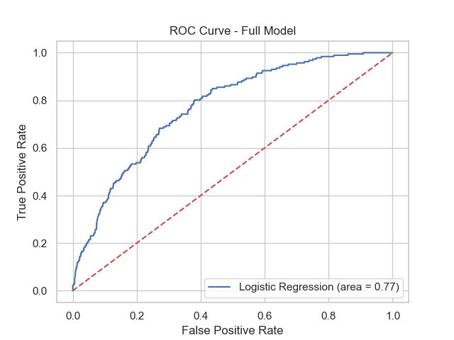
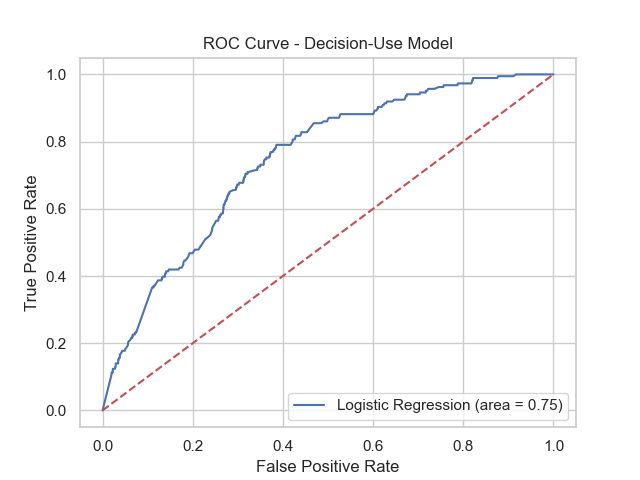

# QMB6315: Python for Business Analytics
## Spring 2025

# Assignment 5

Save your scripts and materials in a folder called ```assignment_05``` in your GitHub respository.


## Full Logistic Regression Model

This is the regression result from the full model estimated in part (a).

```

--- FULL MODEL SUMMARY ---

                           Logit Regression Results                           
==============================================================================
Dep. Variable:                default   No. Observations:                 2377
Model:                          Logit   Df Residuals:                     2367
Method:                           MLE   Df Model:                            9
Date:                Thu, 24 Apr 2025   Pseudo R-squ.:                  0.1439
Time:                        18:51:11   Log-Likelihood:                -558.52
converged:                       True   LL-Null:                       -652.42
Covariance Type:            nonrobust   LLR p-value:                 1.186e-35
================================================================================
                   coef    std err          z      P>|z|      [0.025      0.975]
--------------------------------------------------------------------------------
const           -5.1475      0.643     -8.000      0.000      -6.409      -3.886
bmaxrate        13.3720      2.349      5.692      0.000       8.768      17.976
amount        1.482e-05   1.74e-05      0.851      0.395   -1.93e-05     4.9e-05
close            0.6220      0.166      3.755      0.000       0.297       0.947
AA              -1.2837      0.717     -1.790      0.073      -2.689       0.122
A               -0.6614      0.550     -1.204      0.229      -1.738       0.416
B               -1.0924      0.518     -2.109      0.035      -2.108      -0.077
C               -0.4601      0.314     -1.465      0.143      -1.076       0.156
D               -0.4563      0.239     -1.911      0.056      -0.924       0.012
bankcardutil    -0.5047      0.196     -2.571      0.010      -0.889      -0.120
================================================================================
Optimization terminated successfully.
         Current function value: 0.245008
         Iterations 9

```

This model has the following ROC curve.





## Logistic Regression Model Useful for Credit Decisions

This is the regression result from the model based on only the information 
available when making a credit decision.

```

--- DECISION MODEL SUMMARY ---

                           Logit Regression Results                           
==============================================================================
Dep. Variable:                default   No. Observations:                 2377
Model:                          Logit   Df Residuals:                     2369
Method:                           MLE   Df Model:                            7
Date:                Thu, 24 Apr 2025   Pseudo R-squ.:                  0.1074
Time:                        18:51:12   Log-Likelihood:                -582.38
converged:                       True   LL-Null:                       -652.42
Covariance Type:            nonrobust   LLR p-value:                 4.890e-27
================================================================================
                   coef    std err          z      P>|z|      [0.025      0.975]
--------------------------------------------------------------------------------
const           -1.5182      0.172     -8.822      0.000      -1.855      -1.181
close            0.6210      0.163      3.809      0.000       0.301       0.941
AA              -3.0859      0.597     -5.171      0.000      -4.255      -1.916
A               -2.0579      0.431     -4.780      0.000      -2.902      -1.214
B               -2.1922      0.428     -5.125      0.000      -3.030      -1.354
C               -1.2641      0.236     -5.358      0.000      -1.727      -0.802
D               -0.8801      0.204     -4.323      0.000      -1.279      -0.481
bankcardutil    -0.4829      0.193     -2.500      0.012      -0.861      -0.104
================================================================================
```

This model has the following ROC curve.





